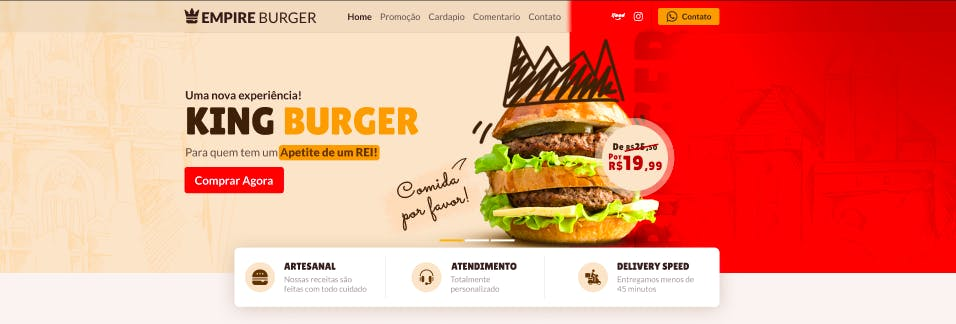

<h1 align="center">
  
</h1>

  

## 💻 Projeto

Esse projeto é uma landing page de uma hamburgueria fictícia chamada **Empire Burger**, nela há seções sobre as ofertas especiais, horário de funcionamento, cardápio contendo os ingredientes e preços, cards com os feedbacks dos clientes e a localização do estabelecimento.

Para facilitar a codificação do projeto foi usado um protótipo do figma como base, o autor do layout é o design [**Tiago Alves**](https://www.behance.net/tiagofenixe9d9), [clique aqui](https://www.figma.com/file/ag4Az50adOF53pBrwI0wFg/Empire-Burger?node-id=0%3A1) para abrir o protótipo no figma.

## 🚀 Tecnologias

- [React](https://pt-br.reactjs.org/)
- [Vite](https://vitejs.dev/)
- [Axios](https://axios-http.com/ptbr/)
- [Typescript](https://www.typescriptlang.org/)
- [SASS](https://sass-lang.com/)

## 📝 Critérios de aceite

- [x] Criar as seguintes seções: Menu, Banner hero, Ofertas especiais, Onde fica o nosso castelo, Footer.

- [x] Ao clicar em um item do menu, o usuário deverá ser levado para a seção correspondente.

- [x] Na seção Ofertas especiais os elementos devem ser organizados com o uso da propriedade display:grid do css.

- [x] As informações do card da oferta(nome do prato e gramagem) devem estar no html, a única imagem deve ser a foto do prato com o preço.

- [x] Na seção Onde fica o nosso castelo você deverá incorporar uma localização do google maps.

### Nível Médio

- [x] Todos os requisitos do nivel fácil.

- [x] Criar as seguintes seções: Cardápio, Atendimento, Nossas entregas.

- [x] Na seção Cardápio os preços devem ser formatados com o método Intl.NumberFormat.

- [x] O card Horário de funcionamento deverá ter os estados aberto e fechado, o estado será alterado conforme o horário do navegador do usuário.

### Nível Difícil

- [x] Todos os requisitos do nivel fácil e médio

- [x] Criar as seguintes seções: Nossa realeza, Publicações do instagram.

- [x] Buscar a lista de itens do cardápio via api.

- [x] Buscar a lista de depoimentos via api.

- [x] Na seção Nossa realeza os depoimentos deverão estar em um carrousel funcional.

- [x] O texto de cada depoimento deverá estar limitado em quatro linhas, você pode usar a propriedade clamp do css.
